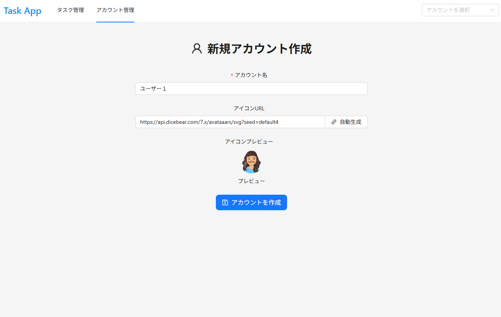

# PerformanceAntd

[English](./docs/lang/en.md) | 日本語

Next.js/Antd における高パフォーマンスな設計を考えるリポジトリ

## 実装 UI(2025.10.01)

<div style="display: grid; grid-template-columns: repeat(2, 1fr); gap: 10px;">
    <figure>
        
        <figcaption>タスク管理(/tasks)</figcaption>
    </figure>
    <figure>
        
        <figcaption>アカウント管理(/accounts)</figcaption>
    </figure>
    <figure>
        
        <figcaption>新規アカウント作成(/accounts/new)</figcaption>
    </figure>
</div>

## パフォーマンスを上げる工夫

### LCP（Largest Contentful Paint）改善

- ページネーションを導入し DOM 要素を減らす
- コンポーネント分割による再レンダリング範囲の最適化
- useCallback/useMemo による不要な再計算の防止

### CLS（Cumulative Layout Shift）改善

- カード要素に固定の高さとサイズを設定
- CSS contain プロパティによるレイアウト安定化
- ページネーション要素の高さ固定
- box-sizing: border-box による要素サイズの安定化

### フォント最適化

- font-display: swap によるフォント読み込み最適化
- preload: true でフォントの事前読み込み
- fallback フォントの指定による初期レンダリング安定化

### DOM 最適化

- text-rendering: optimizeSpeed による描画速度向上
- overflow 制御による不要なスクロール防止
- 要素の最小・最大サイズ指定による安定したレイアウト

## セットアップ手順

1. リポジトリのクローン

   ```bash
   git clone <repository-url>
   cd PerformanceAntd
   ```

2. 依存関係のインストール

   ```bash
   pnpm install
   ```

3. 仮想環境および DB のセットアップ

   ```bash
   # DockerでPostgreSQLを起動
   docker compose up -d

   # データベーススキーマの同期
   npx prisma db push

   # サンプルデータの投入
   pnpm db:seed
   ```

4. サーバーの起動

   ```bash
   pnpm dev
   ```

5. 動作確認
   - ブラウザで `http://localhost:3000` にアクセス
   - アカウント管理とタスク管理機能を確認
