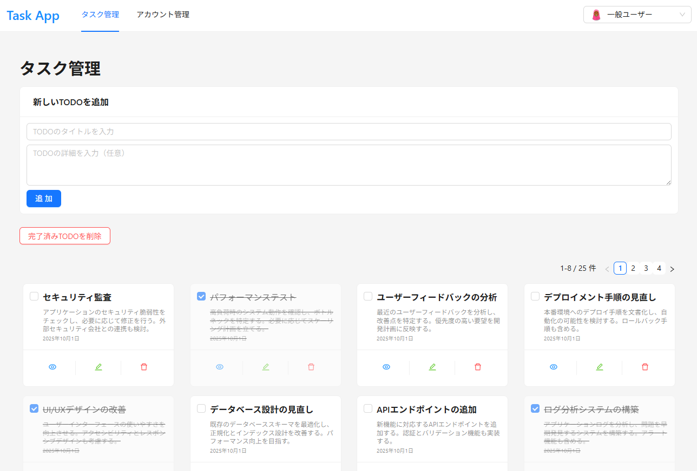
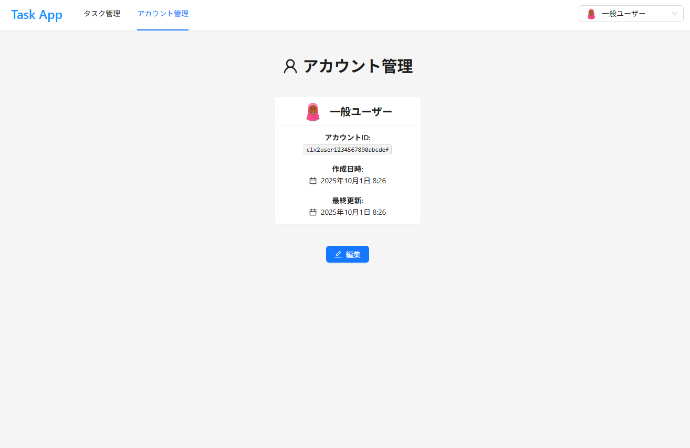
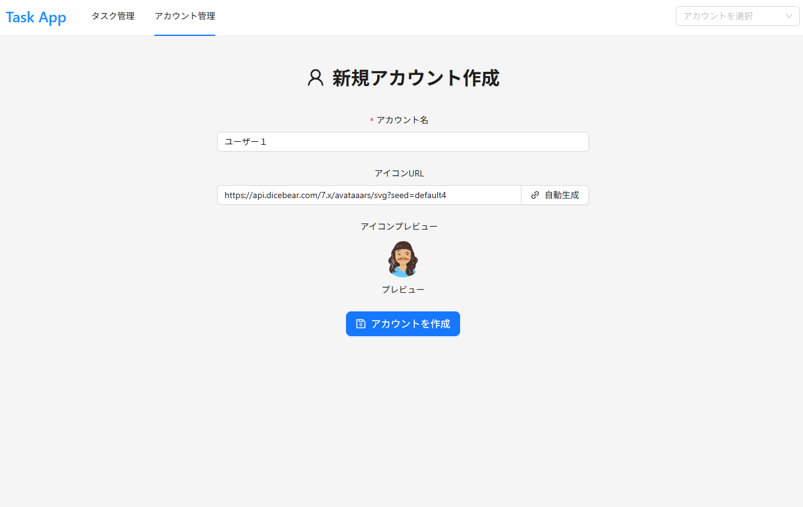

# PerformanceAntd

[日本語](../../README.md) | English

A repository for exploring high-performance design in Next.js/Antd

## Implemented UI (2025.10.01)

<div style="display: grid; grid-template-columns: repeat(2, 1fr); gap: 10px;">
    <figure>
        
        <figcaption>Task Management (/tasks)</figcaption>
    </figure>
    <figure>
        
        <figcaption>Account Management (/accounts)</figcaption>
    </figure>
    <figure>
        
        <figcaption>Create New Account (/accounts/new)</figcaption>
    </figure>
</div>

## Performance Optimization Techniques

### LCP (Largest Contentful Paint) Improvements

- Implement pagination to reduce DOM elements
- Optimize re-rendering scope through component decomposition
- Prevent unnecessary recalculations with useCallback/useMemo

### CLS (Cumulative Layout Shift) Improvements

- Set fixed height and size for card elements
- Stabilize layout with CSS contain property
- Fix pagination element height
- Stabilize element sizes with box-sizing: border-box

### Font Optimization

- Optimize font loading with font-display: swap
- Preload fonts with preload: true
- Stabilize initial rendering by specifying fallback fonts

### DOM Optimization

- Improve rendering speed with text-rendering: optimizeSpeed
- Prevent unnecessary scrolling with overflow control
- Achieve stable layout by specifying minimum and maximum element sizes

## Setup Instructions

1. Clone the repository

   ```bash
   git clone <repository-url>
   cd PerformanceAntd
   ```

2. Install dependencies

   ```bash
   pnpm install
   ```

3. Set up virtual environment and database

   ```bash
   # Start PostgreSQL with Docker
   docker compose up -d

   # Sync database schema
   npx prisma db push

   # Seed sample data
   pnpm db:seed
   ```

4. Start the server

   ```bash
   pnpm dev
   ```

5. Verify the setup
   - Access `http://localhost:3000` in your browser
   - Check account management and task management features
