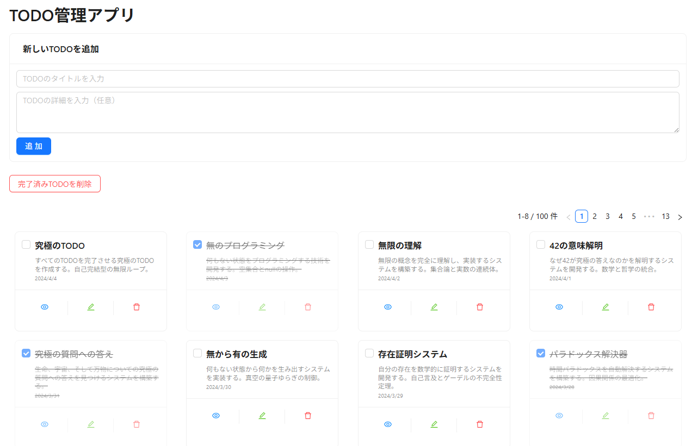

# PerformanceAntd

[日本語](../../README.md) | 英語

A repository for exploring high-performance design in Next.js/Antd

## Implemented UI

## Performance Optimization Techniques

### LCP (Largest Contentful Paint) Improvements

- Implement pagination to reduce DOM elements
- Optimize re-rendering scope through component decomposition
- Prevent unnecessary recalculations with useCallback/useMemo

### CLS (Cumulative Layout Shift) Improvements

- Set fixed height and size for card elements
- Stabilize layout with CSS contain property
- Fix pagination element height
- Stabilize element sizes with box-sizing: border-box

### Font Optimization

- Optimize font loading with font-display: swap
- Preload fonts with preload: true
- Stabilize initial rendering by specifying fallback fonts

### DOM Optimization

- Improve rendering speed with text-rendering: optimizeSpeed
- Prevent unnecessary scrolling with overflow control
- Achieve stable layout by specifying minimum and maximum element sizes
